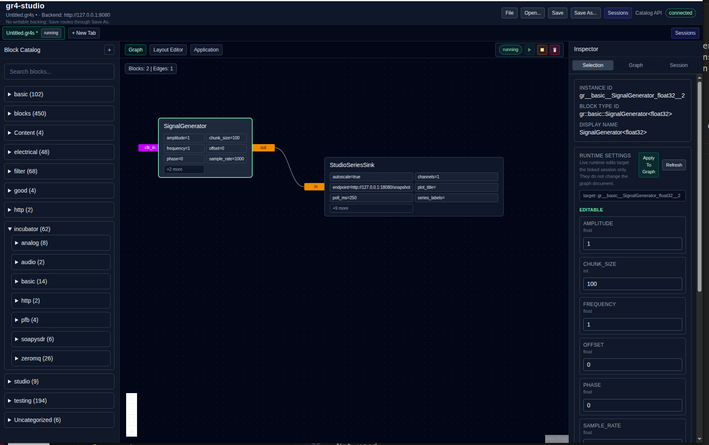
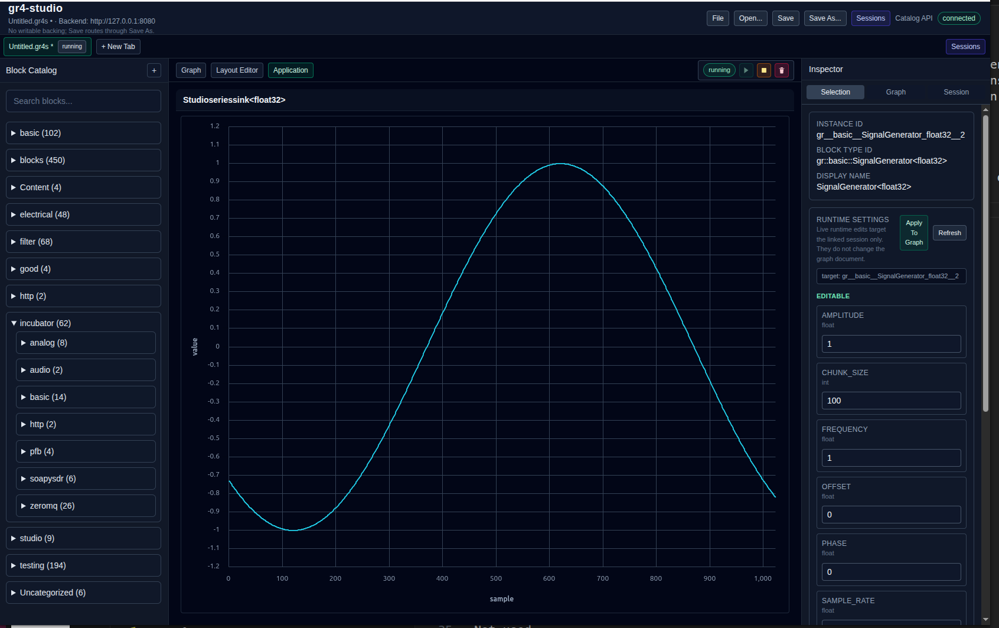

# gr4-studio

`gr4-studio` is a browser-based Studio UI for GR4. The current codebase is a working prototype focused on graph authoring, document persistence, runtime sessions, and live panel rendering for the included Studio blocks shipped in this repo.

## Current surfaces

- `Layout Editor`: author graph tabs, inspect blocks, edit layout metadata, and manage runtime sessions.
- `Application`: render authored panel/layout state with live plot and panel renderers.

## What is implemented

- Graph editing with tabs, block catalog browsing, block properties, and runtime session controls.
- Local document save/open for `.gr4s` files, including browser file-picker support and download fallback.
- Studio-compatible first-party blocks under `blocks/studio`.
- Exact block-ID based binding lookup in `src/features/graph-editor/runtime/known-block-bindings.ts`.
- Live plotting paths for scalar series, 2D series, and DataSet-backed XY payloads.
- Placeholder renderers for panel kinds that are not fully live yet.

## Included block families

- `StudioSeriesSink`
- `Studio2DSeriesSink`
- `StudioDataSetSink`
- `StudioAudioMonitor`
- `StudioImageSink`

Current transport support for the included blocks is limited to:

- `http_snapshot`
- `http_poll`

The block architecture and payload contracts are documented in:

- `docs/studio-blocks-architecture.md`
- `docs/studio-blocks-payload-contracts.md`

## Backend contract

The control plane base URL is configurable in `.env.example` and defaults to `http://localhost:8080`.

Used endpoints:

- `GET /blocks`
- `GET /blocks/{id}`
- `POST /sessions`
- `GET /sessions`
- `GET /sessions/{id}`
- `POST /sessions/{id}/start`
- `POST /sessions/{id}/stop`
- `POST /sessions/{id}/restart`
- `DELETE /sessions/{id}`

Not used:

- graph resources
- graph/session diagnostics endpoints
- history/event-stream/SSE

## Environment

```env
VITE_CONTROL_PLANE_BASE_URL=http://localhost:8080
```

Runtime config is centralized in `src/lib/config.ts`.

## Run

### Native

1. `npm install`
2. `npm run dev`
3. open `http://localhost:5173`

### Docker

```bash
docker compose -f docker-compose.dev.yml up --build
```

Docker dev uses `VITE_CONTROL_PLANE_BASE_URL=http://host.docker.internal:8080`.

## Document format

- `GraphDocument` is the canonical editor save/load format.
- The app reads and writes canonical JSON via the `.gr4s` Studio document format.

## Runtime Model (Per Tab)

Each graph tab stores session-centric runtime state only:

- `sessionId`
- `session`
- `lastSubmittedHash`
- `lastAction`
- `busy`
- `lastError`

Run/Stop correctness is polling-first:

- after create/start/stop/restart, Studio polls `GET /sessions/{id}` until stable (`running`, `stopped`, or `error`)
- backend session state is authoritative
- stale async completions are guarded in the runtime store

## Graph Submission Boundary

Run flow:

1. current editor state -> `GraphDocument`
2. `GraphDocument` -> deterministic inline GRC text (`toGrctrlContentSubmission`)
3. content hash is computed for drift detection
4. if no session or graph content changed, create a new session with `{ name, grc }`
5. start session
6. poll session state to convergence

## UI Surfaces

<p align="center">
  <br>
  <em>Studio Graph Layout</em>
</p>

<p align="center">
  <br>
  <em>Studio Application Runtime</em>
</p>


- Center: graph editor canvas
- Top-right: execution overlay (Run/Stop + restart/refresh/delete secondary controls)
- Right sidebar inspector tabs:
  - Selection
  - Graph (local graph + submission/run-intent state)
  - Session (linked session metadata + local runtime activity)
- Sessions drawer: list/start/stop/restart/delete sessions and link/unlink to active tab

## Notes / Current Limits

- Graph edits are local until Run submits a snapshot.
- Linked session may represent an older snapshot when graph drift is present.
- Events tab was removed for this backend phase because no history/stream endpoint exists.
- AI tools were used in the development of this codebase

## License and Copyright
This project is licensed under the GNU General Public License v3.0 or later (GPL-3.0-or-later).  

Unless otherwise noted: SPDX-License-Identifier: GPL-3.0-or-later

Copyright (C) Josh Morman, Altio Labs, LLC

See the LICENSE file for the full license text.
